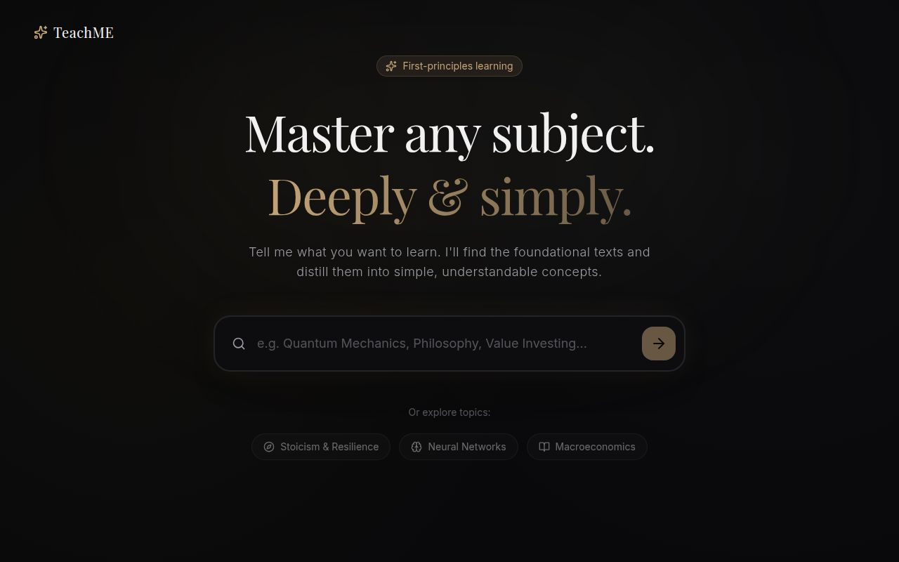
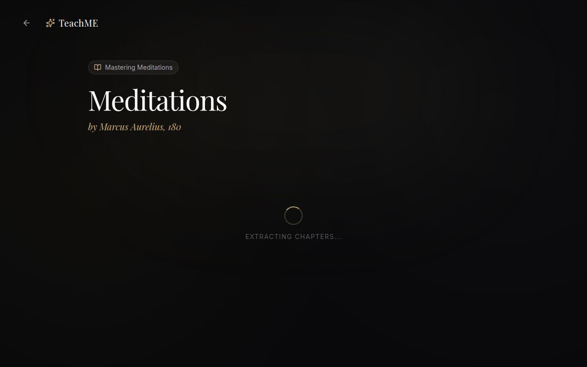

# TeachME

**First-principles learning, powered by AI.** Enter any topic → get the foundational books → explore chapters → deep-dive with streaming explanations → ask questions.

Live at **[teach-me.replit.app](https://teach-me.replit.app)**

---



---

## What it does

Most learning tools summarize. TeachME teaches.

You type a topic — "Stoicism", "Quantum Mechanics", "Value Investing" — and TeachME finds the five most foundational books on it, prioritizing recent, evidence-based, first-principles texts. Pick a book, explore its chapters, and get a streaming deep-dive explanation of any chapter written from the ground up. Then ask follow-up questions in a Q&A chat that keeps the full chapter context in mind.

Everything is generated fresh. No static database, no cached summaries — just live AI reasoning about the actual books.

---

## Screenshots

### Book detail — chapters load instantly from any direct link



---

## Features

- **Topic search** — Find 5 foundational books on any subject, ranked by recency and depth
- **Core Synopsis** — 2–4 sentence synthesis of each book's main contribution
- **Chapter breakdown** — Full structural map of every book with per-chapter summaries
- **Streaming first-principles explanation** — Chapter deep-dives that stream in real time, derived from foundational reasoning
- **Q&A chat** — Ask anything about a chapter; the AI keeps the full explanation in context
- **Direct links** — Every book and chapter has a shareable URL that loads fully without requiring a prior search
- **Public REST API** — Integrate TeachME's book discovery into your own app

---

## Public API

Base URL: `https://teach-me.replit.app/api/v1`

### API definition

```
GET /api/v1
```

Returns the full API specification as JSON.

---

### Discover books on a topic

```bash
curl -X POST https://teach-me.replit.app/api/v1/explore \
  -H "Content-Type: application/json" \
  -d '{"topic": "stoicism"}'
```

**Response:**
```json
{
  "topic": "stoicism",
  "count": 5,
  "books": [
    {
      "id": "lessons-in-stoicism-2020",
      "title": "Lessons in Stoicism",
      "author": "John Sellars",
      "year": "2020",
      "difficulty": "Beginner",
      "summary": "...",
      "keyPrinciples": ["...", "..."],
      "links": {
        "webApp": "https://teach-me.replit.app/books/lessons-in-stoicism-2020?title=...&author=...",
        "chaptersApi": "https://teach-me.replit.app/api/v1/books/lessons-in-stoicism-2020/chapters?title=...&author=..."
      }
    }
  ]
}
```

Extract just the first book's UI link:

```bash
curl -s -X POST https://teach-me.replit.app/api/v1/explore \
  -H "Content-Type: application/json" \
  -d '{"topic": "stoicism"}' | jq -r '.books[0].links.webApp'
```

---

### Get chapters for a book

```bash
curl "https://teach-me.replit.app/api/v1/books/lessons-in-stoicism-2020/chapters?title=Lessons%20in%20Stoicism&author=John%20Sellars"
```

---

### Open a book directly (redirect)

```
GET /api/v1/open/books/:bookId?title=...&author=...
```

A 302 redirect to the TeachME UI. Use this as a clickable link in any other app — tapping it opens the book directly.

---

## Tech stack

| Layer | Technology |
|---|---|
| Frontend | React 18 + TypeScript + Vite |
| Styling | Tailwind CSS + shadcn/ui |
| State | Zustand (with localStorage persistence) |
| Routing | Wouter |
| Animations | Framer Motion |
| Backend | Node.js + Express + TypeScript |
| AI — book search | OpenAI GPT-5.4 (JSON mode) |
| AI — chapters, explain, chat | OpenAI GPT-5.4-mini (streaming) |
| Monorepo | pnpm workspaces |
| Deployment | Replit |

---

## Running locally

### Prerequisites

- Node.js 18+
- pnpm 8+
- An OpenAI API key

### Setup

```bash
git clone https://github.com/anof/teachme.git
cd teachme
pnpm install
```

Create a `.env` file in `artifacts/api-server/`:

```env
OPENAI_API_KEY=sk-...
SESSION_SECRET=any-random-string
```

### Start the API server

```bash
pnpm --filter @workspace/api-server run dev
```

Runs on `http://localhost:8080`

### Start the frontend

```bash
pnpm --filter @workspace/teachme run dev
```

Runs on `http://localhost:3000`

---

## Project structure

```
teachme/
├── artifacts/
│   ├── api-server/          # Express API + OpenAI integration
│   │   └── src/
│   │       └── routes/
│   │           ├── teachme/ # AI endpoints (books, chapters, explain, chat)
│   │           └── v1/      # Public REST API
│   └── teachme/             # React frontend
│       └── src/
│           ├── pages/       # Home, Books, BookDetail, Chapter
│           ├── components/  # Layout, UI primitives
│           ├── store/       # Zustand state
│           └── hooks/       # Streaming hook
└── lib/
    ├── api-client-react/    # Generated React Query hooks
    └── api-zod/             # Shared Zod schemas
```

---

## Contributing

Pull requests are welcome.

1. Fork the repo
2. Create a feature branch (`git checkout -b feature/my-feature`)
3. Commit your changes
4. Open a pull request

Please keep AI model calls minimal and prefer `gpt-5.4-mini` for non-critical paths to keep costs low.

---

## License

MIT — use it, fork it, build on it.
